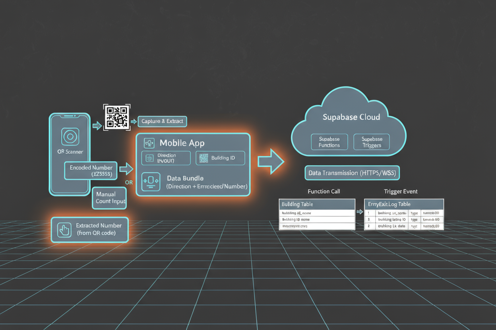

___
# Smart Occupancy Management System
___

## Introduction

The Smart Occupancy Management System builds on the foundation laid during the early prototype phase, which initially introduced a simple QR-based entry/exit tracking solution for monitoring classroom usage. This enhanced mobile application aims to expand and streamline those core functionalities, providing institutions with a more accessible and automated platform for real-time occupancy tracking, user movement logging, and cloud-synchronized data management.

The primary objective of this project is to offer a reliable and user-friendly method for tracking the number of people within a building or room at any given moment. By shifting to a mobile-first solution backed by Supabase, the system supports real-time updates, secure data handling, and scalable cloud integration. Built using MIT App Inventor as the mobile front end and Supabase (PostgreSQL + APIs) as the backend, the system ensures simplicity, reliability, and smooth functionality for both administrators and users.

This report outlines the evolution of the Smart Occupancy Management System, detailing the functional and non-functional requirements, key use cases, testing approaches, and improvements made throughout development. By integrating lightweight mobile technology with a powerful cloud backend, the system takes a significant step toward modernizing occupancy monitoring in academic and organizational environments.

---

## System Architecture

---

## Team Members

- **E/21/229** [Kurera P.A.T.](https://people.ce.pdn.ac.lk/students/e21/229/) [e21229@eng.pdn.ac.lk](mailto:e21229@eng.pdn.ac.lk)  
- **E/21/287** [Perera G.S.H.](https://people.ce.pdn.ac.lk/students/e21/287/) [e21287@eng.pdn.ac.lk](mailto:e21287@eng.pdn.ac.lk)  
- **E/21/350** [Samarawickrama G.B.B.P.](https://people.ce.pdn.ac.lk/students/e21/350/) [e21350@eng.pdn.ac.lk](mailto:e21350@eng.pdn.ac.lk)  
- **E/21/428** [Weerasooriya S.C.](https://people.ce.pdn.ac.lk/students/e21/428/) [e21428@eng.pdn.ac.lk](mailto:e21428@eng.pdn.ac.lk)

---

## Project Supervisors

- [Prof. Roshan G. Ragel](https://people.ce.pdn.ac.lk/staff/academic/roshan-ragel/)  
- [Dr. Isuru Navinne](https://people.ce.pdn.ac.lk/staff/academic/isuru-nawinne/)

---

## Links

- **Mobile Front-End (MIT App Inventor)**  
  

- **Backend (Supabase & Database Structure)**  
  

- [Department of Computer Engineering](http://www.ce.pdn.ac.lk/)  
- [University of Peradeniya](https://eng.pdn.ac.lk/)

